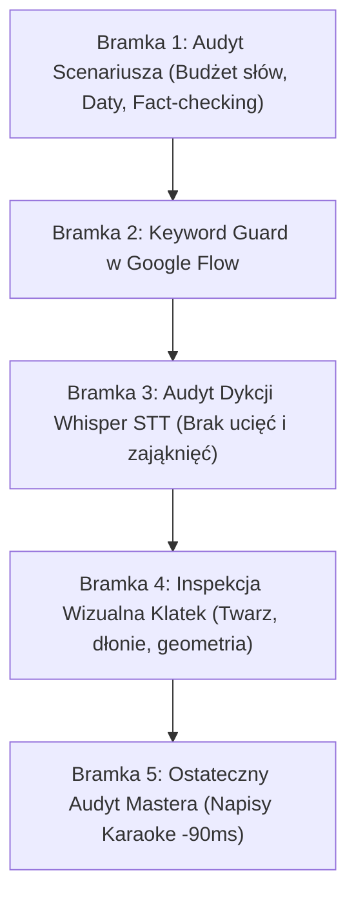

# Documentary Quality Guard

Ten skill instruuje agenta, jak bezkompromisowo egzekwować protokół kontroli jakości (Quality Control Gates) i eliminować wszelkie usterki językowe, wizualne i synchronizacyjne przed publikacją.

---

## Protokół 5 Bramek Kontroli Jakości (Zero Tolerancji dla Błędów)

---

### Bramka 1: Audyt Merytoryczny i Językowy Scenariusza
* **Fact-Checking**: 100% prawdy historycznej i technologicznej. Weryfikacja dat, nazwisk i terminów.
* **Budżet słów**: Żadna kwestia 10-sekundowa A-Roll nie może przekraczać **15–18 słów**.
* **Odmiana liczb i dat**: Bezwzględna kontrola roku 2000 (*„roku dwutysięcznego”*, nigdy *„dwa tysiące roku”*).
* **Eliminacja klisz AI**: Usunięcie wszelkich zwrotów typu *„Warto zauważyć”*, *„Stanowi to kluczowy element”*.

---

### Bramka 2: Weryfikacja Pobierania z Google Flow (Keyword Guard)
* Przed pobraniem pliku skrypt otwiera kartę wideo i sprawdza, czy pole promptu zawiera co najmniej **3 unikalne słowa kluczowe** z zadanego zadania.
* Blokuje pobieranie losowych lub zaniechanych renderów z kolejki.

---

### Bramka 3: Audyt Mowy i Dykcji (Whisper STT)
* Każdy wygenerowany klip A-Roll oraz plik MP3 lektora jest automatycznie transkrybowany skryptem [qc_speech_whisper.py](./scripts/qc_speech_whisper.py).
* **Kryteria dyskwalifikacji (natychmiastowy re-render)**:
  - Ucięcie mowy przed końcem zdania na granicy 10.0s.
  - Zająknięcie, powtórzenie słowa (np. *„do do giełdy”*).
  - Przekręcenie liczby (np. *„2020”* zamiast *„2000”*).

---

### Bramka 4: Wizualna Inspekcja Artefaktów (Visual Glitch Hunt)
* Skrypt [qc_extract_frames.py](./scripts/qc_extract_frames.py) wyciąga klatki kontrolne w punktach $t = 1.0\text{s}$, $5.0\text{s}$ i $9.0\text{s}$.
* **Kontrola**:
  1. Czy rysy twarzy Świadka odpowiadają kotwicy referencyjnej?
  2. Czy nie ma zniekształceń dłoni (np. 6 palców) lub pływających rekwizytów?

---

### Bramka 5: Ostateczny Audyt Zmontowanego Mastera
* Sprawdzenie czy napisy Karaoke ASS wyprzedzają mowę o dokładnie **-90ms**.
* Sprawdzenie czy w zmontowanej osi czasu nie występują powtórzone ujęcia ani przerwy w dźwięku.

Kompletna checklista wdrożeniowa: zobacz [5_stage_qc_checklist.md](./references/5_stage_qc_checklist.md).
