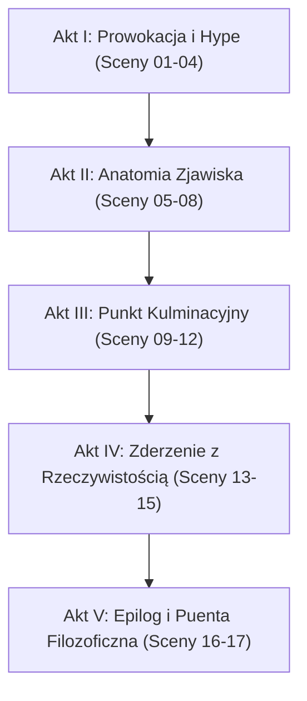

# Metodologia Dramaturgiczna Filmu Dokumentalnego

## 1. Architektura Dialogu i Dźwięku

1. **Świadek Dziejów (A-Roll)**:
   - Centralna postać opowieści, charyzmatyczny 45-letni mężczyzna ze szpakowatym zarostem, w prostej lnianej koszuli.
   - Świadek mówi **własnym głosem z wideo** (Google Flow Omni Flash), posiadając doskonałą synchronizację warg (lip-sync).
   - Świadek nie wykłada encyklopedii – jest prowokatorem myśli, zadaje pytania podważające powszechne mniemania, sprowadza abstrakcję do życiowego faktu.
   - Rygor słów: **maksymalnie 15–18 słów na 10 sekund**. Wypowiedź musi kończyć się przed 8.0s, aby aktor wziął naturalny oddech przed cięciem montażowym.

2. **Lektor (B-Roll)**:
   - Głos Piotr (ElevenLabs v3), barwa głęboka, dojrzała, refleksyjna.
   - Prowadzi widza przez archiwa, mechanizmy ekonomiczne, dane i technologię.
   - Używa tagów ekspresji: `[thoughtful]`, `[ironic]`, `[pause]`, `[whispers]`.

---

## 2. Prawidła Kompozycyjne 5 Aktów

1. **Akt I**: Otwarcie w centrum euforii lub przełomu. Świadek rozmawia ze sceptykiem lub entuzjastą.
2. **Akt II**: Wnikliwa analiza, jak doszło do szaleństwa wycen lub ślepej wiary.
3. **Akt III**: Konkretne case study (np. Pets.com, kryzys 1929, bitwa pod Kłuszynem). Zderzenie teorii z bezwzględną praktyką.
4. **Akt IV**: Pęknięcie, konsekwencje, rachunek zysków i strat.
5. **Akt V**: Klamra kompozycyjna i ponadczasowa prawda dla widza.
