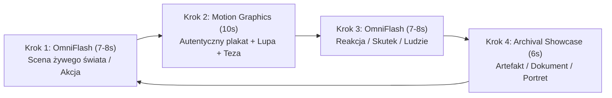

# Matryca Decyzyjna: Archiwum vs Google Flow

Podczas produkcji eseju dokumentalnego agent AI musi natychmiast rozstrzygnąć, które elementy scenariusza należy pozyskać z archiwów internetowych, a które wygenerować za pomocą modelu wideo **Google Flow (Omni 1.1 Flash)**. 

Błędna decyzja niszczy wiarygodność filmu: wygenerowanie historycznego plakatu przez model wideo prowadzi do halucynacji typograficznych i zniekształcenia faktów, z kolei próba zmontowania całego filmu wyłącznie ze statycznych zdjęć sprawia, że materiał staje się nudny i statyczny.

---

## 1. Złota Zasada Podziału Wizualnego

> **ZASADA ZŁOTEGO CIĘCIA DOKUMENTALNEGO:**
> * **100% Prawdy Faktograficznej**: Dowody, plakaty, nagłówki, wykresy i konkretne artefakty pobieramy z **Internetu** i animujemy w kodzie HTML/JS.
> * **100% Klimatu i Ruchu**: Ulice, tłumy, wnętrza z epoki, gesty postaci, dym, deszcz, laboratoria i procesy fizyczne generujemy w **Google Flow Omni 1.1 Flash**.

---

## 2. Tabela Porównawcza: Co Gdzie Kierować?

| Element Scenariusza | Rekomendowane Źródło | Dlaczego to źródło? | Przykład z produkcji |
| :--- | :--- | :--- | :--- |
| **Plakat z hasłem reklamowym** | 🌐 **Internet (Archiwum)** | Model AI generuje nieczytelny bełkot w napisach; widz musi zobaczyć prawdziwy krój pisma i autentyczne hasło. | Plakat *„Cukier krzepi”* (Mackiewicz 1931), reklama *„More Doctors Smoke Camels”* (1946). |
| **Ulica z epoki (ruch miejski, tłum)** | 🤖 **Google Flow (OmniFlash)** | Model doskonale oddaje głębię ostrości, vintage samochody, bruk i ruch pieszych w strojach z lat 30. | Spacerujący ludzie przed witrynami sklepów, tramwaje, deszcz na bruku (`flow_13_ulica_lata30`). |
| **Butelka leku / preparatu** | 🌐 **Internet (Fotografia)** | Etykieta ze składem chemicznym i ostrzeżeniami musi być w 100% czytelna pod lupą inspekcyjną. | Oryginalna butelka *Radithor* z napisem o radzie 226 i 228, flakonik *Heroin Bayer* z 1898 r. |
| **Scena podawania leku / badania** | 🤖 **Google Flow (OmniFlash)** | Żywa interakcja ludzi – emocje matki podającej syrop choremu dziecku w łóżku. | Matka z łyżeczką syropu przy łóżku dziecka w wiktoriańskiej sypialni (`flow_20`). |
| **Wycinek z gazety / Nekrolog** | 🌐 **Internet (Archiwum)** | Twardy dowód śledczy. Widz czyta autentyczny nagłówek z datą i nazwą gazety. | Artykuł *Wall Street Journal* o śmierci Ebena Byersa (1932). |
| **Dżentelmen na polu golfowym** | 🤖 **Google Flow (OmniFlash)** | Przedstawienie statusu społecznego ofiary (roaring twenties, bogaty przemysłowiec). | Elegancki mężczyzna w tweedowych pumpach uderzający kijem golfowym we mgle (`flow_21`). |
| **Emaliowany szyld / logo koncernu** | 🌐 **Internet (Archiwum)** | Faktura rdzy, zadrapania, oryginalny znak towarowy Atlantic Ethyl czy Bayera. | Tablica stacji benzynowej *„Ethyl Gasoline”* z 1925 roku. |
| **Praca w rafinerii / fabryce** | 🤖 **Google Flow (OmniFlash)** | Ciężki przemysł, para, iskry, monumentalne wieże destylacyjne i robotnicy w maskach. | Dwóch robotników w grubych drelichach przekręcających żeliwny zawór pod ciśnieniem (`flow_22`). |
| **Przekrój mechaniczny / chemia** | 💻 **Motion Graphics (SVG)** | Żaden model wideo nie stworzy precyzyjnego schematu inżynieryjnego tłoka silnika ze spalaniem stukowym. | Wektorowy schemat cyklu pracy silnika 4-suwowego i wzór $Pb(C_2H_5)_4$ (`mg_06`). |
| **Nowoczesne laboratorium biotech** | 🤖 **Google Flow (OmniFlash)** | Kontrast historyczno-współczesny: sterylne cleanroomy, wirówki, pipety, monitory. | Naukowcy w białych fartuchach i okularach pracujący przy aparaturze analitycznej (`flow_23`). |
| **Współczesna puenta (smartfony)** | 🤖 **Google Flow (OmniFlash)** | Metafora cywilizacyjnego transu: tłum idący ulicą, zapatrzony w świecące ekrany telefonów. | Nowoczesna aleja miejska o zmierzchu, ludzie z opuszczonymi głowami wpatrzeni w smartfony (`flow_05`). |
| **Matryca porównawcza Wczoraj vs Dziś** | 💻 **Motion Graphics (JS)** | Zestawienie 4 epok z dzisiejszymi odpowiednikami (e-papierosy, biohacking, opioidy, algorytmy). | Tabela analityczna z 3 pytaniami ochronnymi sceptycyzmu naukowego (`mg_17`). |

---

## 3. Formuła Montażowa: Rytm Przejść (The Dynamic Flow Cycle)

Aby film trzymał tempo i hipnotyzował widza, montażysta nie może układać ujęć losowo. Stosujemy **rotacyjny cykl 4 kroków**:

### Dlaczego ten cykl jest bezkonkurencyjny?
1. **Widz nie doznaje znużenia statyką**: Po animacji analitycznej natychmiast następuje filmowy ruch kamery w wygenerowanej scenie.
2. **Widz nie ma wrażenia „sztuczności AI”**: Ciągłe przeplatanie generowanego wideo z autentycznymi plakatami i dokumentami sprawia, że film odbierany jest jak wysokobudżetowy dokument telewizyjny (Netflix / BBC).
3. **Każde ujęcie trwa dokładnie tyle, ile wymaga percepcja**: OmniFlash ~7–9 sekund, Motion Graphics dokładnie 10.0 sekund, plansze archiwalne 5.5–6.5 sekundy.
